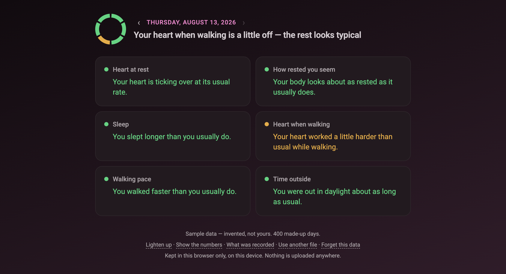

# Wellness Translator

[](https://github.com/DevOpsPink/wellness-translator/actions/workflows/ci.yml)

### → **[wellness-translator.netlify.app](https://wellness-translator.netlify.app)**

A web page that reads your Apple Health export and tells you, in plain English,
whether today is unusual *for you* — not against a population norm, against
your own last week.



*The sample view, on invented data —
[open it](https://wellness-translator.netlify.app/?sample).*

## Using it

1. On your iPhone: **Health → your picture, top right → Export All Health
   Data.** It takes a few minutes and produces an `export.zip`.
2. Get that file onto a computer. AirDrop is easiest.
3. Open **[the page](https://wellness-translator.netlify.app)** and pick the
   zip. That is the whole thing.

No account, no sign-up, no upload. The file is read inside your browser and
never leaves your machine — the page makes no network requests at all, and the
served headers forbid it from making any. Close the tab and nothing of yours
went anywhere.

No Apple Watch, or just want to see what it looks like?
**[Open the demo](https://wellness-translator.netlify.app/?sample)** — 400
invented days, nothing to download.

---

Everything below is the reasoning. The short version: I was given a
specification, I built it exactly, and then measuring it against years of real
data showed that the rule at the heart of it was wrong. Fixing that is the most
interesting thing in this repository.

> **A note on the numbers in this document.** Every figure quoted below comes
> from the generated sample data, not from anyone's real health record. The
> findings were made on a real export; the numbers used to illustrate them are
> invented, because a README is public forever.

## The idea

Six metrics, compared against your personal 7-day rolling average:

| Metric             | Bad direction | What it adds                          |
| ------------------ | ------------- | ------------------------------------- |
| Heart at rest      | higher        | what the body costs while still       |
| How rested you seem| lower         | how much slack the nervous system has |
| Sleep              | shorter       | the night behind the day              |
| Heart when walking | higher        | what the same walk costs today        |
| Walking pace       | lower         | fatigue you have not noticed yet      |
| Time outside       | lower         | how much of the day happened outside  |

The first three came from the specification. I chose the other three from what
a real export turned out to contain — each is recorded on most days, and none
of them is a step count.

## The rule in the spec was wrong

The specification said: green within ±5% of your baseline, yellow at 5–10%
worse, red beyond that. One rule, all metrics. It reads like a considered
decision, and I implemented it precisely.

Then I measured how far each metric actually moves on an ordinary day, and the
rule fell apart. Resting heart rate drifts about 3% from its baseline on a
normal day, so a 5% line catches something real. Time outside drifts about 32%,
because some days you are out for twenty minutes and some for four hours — a 5%
line there is not a threshold, it is a rounding error.

Measured across the sample, here is what the fixed rule did against what
counting in *typical days for that metric* does instead:

| Metric              | An ordinary day moves it | Flagged under 5% / 10% | Flagged now |
| ------------------- | ------------------------ | ---------------------- | ----------- |
| Heart when walking  | 2.7%                     | 8%                     | 11%         |
| Walking pace        | 2.9%                     | 15%                    | 8%          |
| Heart at rest       | 3.1%                     | 11%                    | 8%          |
| How rested you seem | 13.2%                    | 39%                    | 8%          |
| Sleep               | 15.0%                    | 46%                    | 10%         |
| Time outside        | 32.0%                    | 49%                    | 9%          |

Half of all daylight days raised a warning. An alarm that sounds every other
day is not an alarm — you stop looking at it, including on the day it is right.

So each metric is now measured against its own ordinary day: the median
distance from baseline over its last 90 *recorded* days.

- 🟢 **Green** — no further off than twice an ordinary day
- 🟡 **Yellow** — two to three times an ordinary day
- 🔴 **Red** — more than three times
- ⚪️ **Collecting data** — too little history to judge, so nothing is claimed

That levels every card to roughly 90% green, so a colour means the same thing
wherever it appears. I used the median rather than the mean so that a fortnight
of illness does not raise the bar for noticing the next one. The spec's 5%
survives as the fallback for a metric with too little history to know its own
spread — the one job it is actually suited to.

**Recorded days, not calendar days.** Sleep goes missing for weeks at a time. A
ninety-day window kept finding too few readings and falling back to the guess,
on the metric whose spread was furthest from the guess.

### One timescale cannot see everything

I then tried to detect runs — several off days in a row, which for a noisy
metric means more than any single day does. It almost never fired, and the
reason turned out to be more useful than the feature.

The baseline is a seven-day average. A metric that drops and stays down is back
inside its own normal within about four days: the baseline chases the change
and swallows it. **The daily verdict cannot see a sustained shift, by
construction.** No amount of work on it would have helped.

So there is a second, slower comparison on each card: this week's average
against the last three months'. It answers a different question — not "is today
unusual" but "has your usual moved" — and it finds what the daily view
structurally cannot. In the sample, daylight runs as much as 95% above its
season and sleep 22% below, on days the daily card calls unremarkable.

## What the screen shows

A ring and a line for the day on top, six cards below. A card is a name, a
colour and a sentence — nothing else, unless you ask.

The ring is one segment per card: same size, same order, same colours. Six
sentences is reading; the ring is glancing. Equal segments rather than
proportions on purpose, so they can be counted.

**I took the numbers off the card.** They arrived one at a time, each
defensible on its own — the reading, the baseline, the percentage, thirty days
of marks, two lines of statistics — and together they buried the thing the app
is for. Someone looking at *40 ms · −10%* has no way of knowing whether that is
bad news, and the sentence beside it, which is the actual product, had shrunk to
a caption. They are all still there behind **Show the numbers**. The page opens
plain.

**I renamed the metrics.** "HRV" is three letters that mean nothing to most
people, and "recovery signal" only swapped them for an instrument. The card now
says "How rested you seem", which is what the number is about.

**I threw away the chart.** Each card used to carry a sparkline. It scaled
itself to whatever range its thirty days happened to cover, so a heart rate
wandering between 68 and 72 drew exactly the same dramatic peaks as one swinging
from 50 to 90 — the most eye-catching thing about the picture carried no
information at all. It was also the wrong instrument for an app whose premise is
turning numbers into words: it handed back a shape to decode. In its place, one
mark per day coloured the way that day's card would have been, and a sentence
counting them. Marks can be counted; a slope has to be interpreted.

**There are two voices.** Plain is flat and careful; playful has a pulse — "A
bit of a cave day" instead of "You saw a little less daylight than you usually
do". Tone is a decision, so it is a switch rather than something I chose once
and silently. The red lines stay warm in both: the app can see a number move and
cannot see why, and behind a bad week there may be flu, a sick child or a
funeral.

## Principles

- No cloud storage, no accounts, no network requests of any kind
- No engagement mechanics, no streaks, no notifications
- **No composite score.** Averaging six metrics into one number would invent a
  precision none of them has and hide the only thing worth knowing — which one
  moved.
- **Describe, never diagnose or prescribe.** The app can see that a number
  moved. It cannot see why, and it is not a doctor.
- **Never state a cause without evidence for it.** Sleep can say the watch was
  off, because the overnight heart rate proves it. Nothing else offers a reason.

## Reading an Apple Health export

On iPhone: Health → your picture, top right → Export All Health Data. Pick the
`export.zip` that arrives; the `export.xml` inside works too.

Taking the zip directly needed about a hundred lines of `src/lib/zip.js`,
because asking someone to unzip first and then find `export.xml` among the
workout routes and electrocardiograms is a step people give up at. A zip is read
from its back end: the last record points at a table of everything in the
archive, each row of which points at where that file's bytes start. From there
the browser's own `DecompressionStream` inflates it. No ZIP64, no encryption —
Apple's export needs neither, and code that claims to handle what it has never
been run against is worse than code that says plainly what it does not do.

The data is big: a few years of a watch writing every heartbeat runs well past a
gigabyte. It cannot be held in a string and it cannot go through DOMParser, so
it is streamed — chunks in, lines out, one `indexOf` per line to reject the
millions of records nothing here wants. A 1.6 GB export is read in about two
seconds. Going in through the zip is *faster* than reading the loose XML,
because 90 MB off the disk plus native inflate beats 1.6 GB off the disk.

It is read in the browser and never uploaded.

Seven decisions were forced by what real exports contain:

- **Sleep segments are merged, not summed.** A watch and a phone both record the
  same night, and the watch alone splits it into dozens of stage segments.
  Adding their durations up invents twenty-hour nights.
- **Only `Asleep*` counts.** `InBed` is lying down and overlaps the asleep
  segments it brackets; `Awake` is the opposite.
- **A night belongs to the morning it ends on**, so it lines up with the day
  that follows it.
- **Under an hour of sleep is treated as unrecorded.** Exports are full of days
  holding six or eight minutes of "asleep" — a watch picked up briefly. At face
  value that reads as 98% below baseline and lights up red: a false alarm
  manufactured out of an absence.
- **Some metrics are summed, others averaged.** Daylight arrives as five-minute
  chunks. Averaging them would report five minutes a day.
- **A reading belongs to the day its window mostly covers.** A resting heart
  rate spans thirteen hours on average and about one in ten crosses midnight;
  filing by start time puts a reading mostly taken on Tuesday under Monday.
- **Units come from the file**, because the export uses whatever the phone is
  set to and a walking speed can arrive as km/hr or mi/hr.

Timestamps carry their own UTC offset, and both readings are kept: the absolute
instant, for deciding whether two sleep segments overlap, and the wall clock
date as written, which is the one a person means by "Tuesday" even if they were
somewhere else that week.

### Was the watch even on?

A night with no sleep recorded looks identical whether you slept badly or left
the watch on the charger. But a watch on a wrist takes a heart rate reading
every few minutes regardless of what it makes of your sleep, so the ordinary
heart rate stream answers what the sleep records cannot.

The separation is stark. Counting readings between midnight and six, nights
with sleep recorded have dozens; nights without have almost none. A blank night
therefore gets one of three explanations: the watch was off, it was on for part
of the night, or it was on all night and recorded nothing anyway — which is a
settings problem rather than a habit, and the only one of the three a person can
go and fix.

If an export holds no heart rate at all, the answer is "unknown" rather than
"off". Absence of the signal is not the signal — told otherwise, the app
confidently claimed the watch had been off on every single night.

The window is local clock time, which suits someone who sleeps at night and
would misjudge someone who works nights.

### What was actually recorded

A second screen shows how complete the record is: days with a reading out of
the last ninety, per metric, and how far each goes back.

I added it because the most useful thing this app found in a real export was
not about health at all — it was that one metric had barely been recorded for
months, and it could say why. None of that is visible in Apple Health, or in
the apps built on top of it, and unlike a heart rate reading, every line of it
can be acted on.

Only sleep gets its blanks explained, for the reason above: the overnight heart
rate is evidence about the night and about nothing else.

### Remembering an import

The parsed days — one row each, a few hundred kilobytes — are kept in
`localStorage`, so opening the page again does not mean re-reading a gigabyte.
It never leaves the device, and **Forget this data** wipes it.

The app opens on the most recent day that has most of its readings in, not the
last row in the file. An export is made partway through a day, so its final
entry holds whatever had synced by then — often a heart rate and nothing else,
which looks like a broken app rather than an early one.

## Running it yourself

Plain HTML, CSS and ES modules: no build step, no dependencies, nothing to
install. Browsers refuse to load ES modules over `file://`, so serve the
folder:

```bash
python3 -m http.server 8000
```

Then <http://localhost:8000> to pick an export, or
<http://localhost:8000/?sample> to go straight to the invented data.

Arrow keys, or the chevrons beside the date, walk back through the history.
Every state the app can be in is reachable that way, including the early days
when there was not yet enough history to judge anything.

## Tests

```bash
npm test
```

Node's own runner, no dependencies, no framework — `package.json` exists to say
these files are ES modules and nothing else. Seventy-five tests over the logic,
which is all pure functions: the baseline and both timescales, the thresholds,
every phrase in both voices, the summary line across all 4,096 combinations of
six card states, the importer's rules about sleep and midnight, and the zip
reader against an archive the test builds byte by byte rather than a fixture
written with the same assumptions as the reader.

Most are named after something that was once wrong, so it cannot come back
quietly: the boundary floating point could not represent, the confident lie
about the watch, the dot on the wrong day, the sentence that read as a
contradiction.

The interface is not tested. It is checked by driving the page in a browser,
which is honest about what that is worth.

CI runs the suite on two Node versions, and runs `scripts/audit-history.sh`
over the full history on every push. That second job is the one that matters
here: this app is built on the promise that health data stays on your machine,
and the check makes sure the promise holds for its author too — no figure from
a real export in any file, any old version of a file, or any commit message.

## Colour

The palette is [devops.pink](https://devops.pink)'s, taken the way that site
builds it rather than by eyedropper: one hue — 340 — with everything else
derived from it in OKLCH. `--hue` in `src/styles.css` is the single knob.

The traffic light is the exception. A red that has drifted towards the pink
beside it stops working as a warning, so the three statuses keep hues held well
away from 340 and from each other. What makes them look like one family is the
lightness they share — and that shared lightness is also what makes them
legible, so the palette and the contrast floor are settled by one decision.

Every text pair was measured against its real background rather than eyeballed:
all ten clear WCAG AA in both themes, the tightest at 4.69:1.

## Layout

```
index.html                     the single screen
src/app.js                     pulls it together, renders the cards
src/styles.css                 all colours, including the traffic light
src/lib/zip.js                 reaches export.xml inside export.zip
src/lib/health-import.js       streams export.xml into daily records
src/lib/baseline.js            the rolling average and the two timescales
src/lib/metrics.js             metric definitions, thresholds, wording
src/lib/coverage.js            how complete the record is
src/lib/donut.js               the ring above the cards
src/lib/stored-data.js         keeps the import in localStorage
src/data/sample-data.js        400 invented days, for the sample view
```

All wording lives in `src/lib/metrics.js` — one file to open to reword the app
or translate it.

## The sample data

400 invented days, from a fixed seed so the demo is the same every time, ending
on today so it never goes stale. Long enough for everything to engage: seven
days for a baseline, thirty for the strip of daily marks, ninety for the
variability that sets the thresholds, ninety more behind that for the
week-against-season comparison.

Each metric is tuned so the app measures the same wander it measures on a real
export, because thresholds derived from spread need a spread worth deriving
from. It has gaps in it too, including a fortnight with the watch off, since the
states built for missing data would otherwise never be seen.

## Status

Working, and finished as a piece of work. Not a product: Apple ships something
similar for free, on the wrist, and this needs a file.

What it does that they do not: it explains *why* data is missing, it covers
daytime metrics and not only overnight ones, it refuses to reduce you to a
score, and every number stays on your machine.

iOS is not in scope. Live data would need a native client with HealthKit
access, which a web page cannot have.
